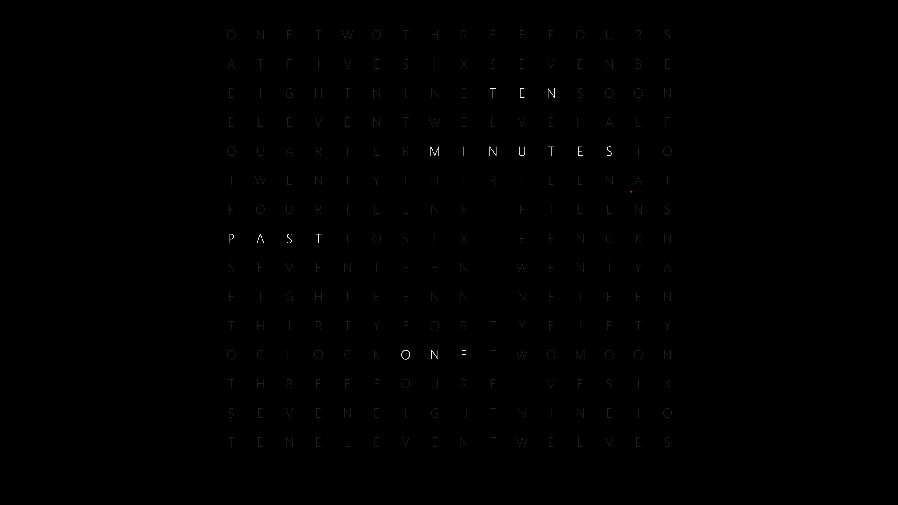

# Grid Clock Screensaver

- build with tauri and vanilla js

- just select the correct toolchain and `cargo tauri build` the project and you're good to go (perhaps idk, only tested on Windows as of now).

- shamelessly stolen from [grid-lock-screensaver](https://github.com/chrstphrknwtn/grid-clock-screensaver)

